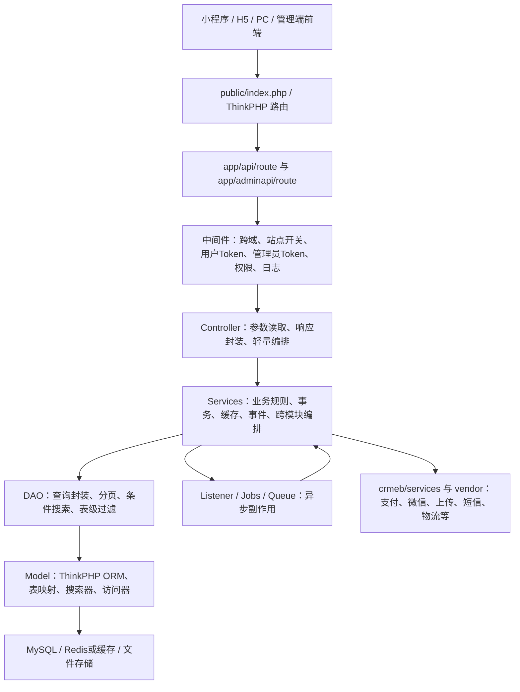

# 后端架构梳理（2026-06-24）

## 1. 项目定位

当前后端位于 `src/CRMEB/CRMEB-master/crmeb`，是基于 ThinkPHP 多应用模式的 CRMEB 后端。经过本轮核心功能收口后，后端保留的主要能力是：

- C 端/小程序接口：登录、首页、商品分类、商品详情、购物车、订单确认、订单创建、支付、售后、用户中心、地址、等级、分销账单、积分记录、签到、教育测评记录。
- 管理端接口：商品、分类、规格、标签、保障、订单、售后、用户、系统、设置、财务基础统计、积分与签到、教育模块。
- 基础设施：JWT 鉴权、RBAC 权限、菜单过滤、事件监听、队列任务、支付回调、上传、短信、微信、物流、打印、缓存、日志。

旧活动、优惠券发放、直播、积分商城订单、抽奖、发票、客服等入口已从主要路由和菜单回显面收口；部分历史服务目录仍存在，需要按后续数据层/服务层审计继续缩减。

## 2. 总体分层

## 3. 目录职责

| 路径 | 职责 |
| --- | --- |
| `app/api` | C 端、小程序、H5、PC 公开接口应用，包含路由、控制器、中间件、校验器。 |
| `app/adminapi` | 管理端接口应用，包含后台路由、控制器、管理员鉴权、权限校验和后台日志。 |
| `app/services` | 核心业务服务层。负责交易规则、订单流转、商品管理、用户体系、支付编排、系统配置等。 |
| `app/dao` | 数据访问层。封装模型查询、分页、字段筛选、特殊搜索条件。 |
| `app/model` | ORM 模型层。定义表名、主键、搜索器、访问器、关联关系。 |
| `app/jobs` | 队列任务。承载订单后置处理、库存、通知、退款、自动取消、自动收货等异步任务。 |
| `app/listener` | 事件监听器。订单、支付、用户、通知、队列启动等事件入口。 |
| `app/http/middleware` | 跨应用通用中间件，例如跨域。 |
| `crmeb/services` | CRMEB 基础服务封装，例如微信、支付、上传、短信、物流、打印、Workerman。 |
| `config` | ThinkPHP 与业务配置。包括数据库、缓存、队列、支付、上传、日志、退役菜单过滤等。 |
| `public` | Web 根目录、静态资源和入口文件所在区域。 |
| `vendor` | Composer 第三方依赖。 |

## 4. 应用入口与路由

### C 端接口

C 端主要路由在：

- `app/api/route/v1.php`
- `app/api/route/v2.php`
- `app/api/route/pc.php`

保留的关键分组：

- 基础公开接口：登录、注册、短信/图形验证码、站点配置、首页、搜索、分类。
- 商品与购物车：商品分类、商品列表、商品详情、购物车列表、添加、删除、数量修改。
- 订单：订单确认、金额计算、订单创建、订单列表、详情、支付、收货、物流、再次下单、收银台。
- 售后：退款原因、申请退款、退款单列表、详情、取消申请、退货物流。
- 用户：用户信息、地址、签到、等级、分销账单、会员卡、积分记录。
- 教育：测评记录提交。

C 端典型中间件：

- `AllowOriginMiddleware`：跨域。
- `StationOpenMiddleware`：站点开关。
- `AuthTokenMiddleware`：用户 JWT 解析，可强制或非强制登录。
- `CustomerMiddleware`：移动端商家/客户相关上下文。
- `BlockerMiddleware`：仍存在于部分敏感动作上，用于阻断已收口功能或高风险动作。

### 管理端接口

管理端路由按业务拆分在 `app/adminapi/route`，当前主要文件包括：

- `product.php`：商品、分类、规格、评论、标签、参数、保障。
- `order.php`：订单、发货、退款、售后、物流、电子面单。
- `user.php`：用户列表、用户详情、用户等级、余额/积分相关基础管理。
- `system.php`：后台菜单、权限、管理员、角色、系统字典。
- `setting.php`：系统配置、协议、上传、基础设置等。
- `marketing.php`：当前仅保留积分记录、积分统计、签到奖励。
- `education.php`：教育业务后台接口。
- `finance.php`、`statistic.php`、`file.php`、`common.php`、`notify.php` 等基础能力。

管理端统一中间件链通常是：

- `AllowOriginMiddleware`
- `AdminAuthTokenMiddleware`
- `AdminCheckRoleMiddleware`
- `AdminLogMiddleware`

这意味着管理端请求先解析管理员 token，再做角色权限校验，最后记录后台操作日志。

## 5. 核心业务链路

### 商品管理链路

管理端商品入口：

`adminapi/route/product.php` -> `adminapi/controller/v1/product/StoreProduct.php` -> `services/product/product/StoreProductServices.php` -> 对应 DAO/Model。

主要职责：

- 商品列表、详情、新增、编辑、上下架、回收站。
- 商品规格、属性、库存、价格。
- 商品分类、标签、参数、保障、评论。
- 商品编辑草稿缓存。

当前仍可见部分字段与历史营销有关，例如 `coupon_ids`、`activity`、`is_gift`、`give_integral`。这些字段不等于入口仍开放，但后续如果要继续缩到极简商品模型，需要单独做数据结构和表单层审计。

### 购物车与下单链路

C 端购物车/订单入口：

`api/route/v1.php` -> `api/controller/v1/store/StoreCartController.php` / `api/controller/v1/order/StoreOrderController.php` -> `services/order/*`。

核心流程：

1. 商品加入购物车。
2. 订单确认 `order/confirm` 拉取用户、地址、商品、运费等确认页数据。
3. 金额计算 `order/computed/:key` 调用 `StoreOrderComputedServices`。
4. 订单创建 `order/create/:key` 调用 `StoreOrderCreateServices`，并通过缓存锁避免重复创建。
5. 订单支付 `order/pay` 调用支付编排服务。
6. 支付回调由 `PayController/notify` 进入，经过 `NotifyListener` 和订单支付成功监听器触发后置处理。

### 支付与订单后置处理

支付相关服务集中在：

- `services/pay`
- `crmeb/services/pay`
- `app/listener/pay/NotifyListener.php`
- `app/listener/order/OrderPaySuccessListener.php`

订单后置处理使用事件与任务解耦：

- `OrderCreateAfterListener` / `OrderCreateAfterJob`
- `OrderPaySuccessListener`
- `OrderDeliveryListener`
- `OrderTakeListener`
- `RefundOrderJob`
- `ProductStockJob`
- `UnpaidOrderCancelJob`

这种结构让控制器只返回当前请求结果，库存、通知、自动取消、自动收货等副作用由异步任务继续处理。

### 用户与权限链路

C 端用户登录和 token：

`LoginController` -> `UserAuthServices` / `BaseServices::createToken()` -> `JwtAuth`。

请求进入受保护接口后，`AuthTokenMiddleware` 解析 `Authori-zation` 或 `Authorization` 头，并向 Request 注入：

- `user()`
- `uid()`
- `isLogin()`
- `tokenData()`

管理端管理员 token：

`AdminAuthTokenMiddleware` -> `AdminAuthServices::parseToken()`，并向 Request 注入：

- `adminId()`
- `adminInfo()`
- `isAdminLogin()`

管理端菜单和权限通过 `SystemMenusDao` 查询，并叠加退役菜单过滤。

## 6. 数据访问模式

后端采用三层数据访问：

1. Controller 不直接写复杂查询，只负责入参和响应。
2. Service 继承 `BaseServices`，通过注入 DAO 复用 CRUD、事务、分页、token、工具方法。
3. DAO 继承 `BaseDao`，绑定具体 Model，封装 `search()`、分页、字段、排序、聚合等查询。
4. Model 继承 `crmeb\basic\BaseModel`，使用 ThinkPHP ORM 和 `ModelTrait`，通过 `searchXxxAttr` 实现条件搜索器。

典型例子：

- `SystemMenusDao` 绑定 `SystemMenus` 模型。
- `SystemMenus` 映射 `system_menus` 表。
- DAO 的菜单查询统一调用 `withoutRetiredMenus()` 注入退役菜单过滤条件。
- Model 的 `searchRetiredMenuAttr` 负责把过滤条件落到 SQL 查询。

## 7. 配置与基础设施

关键配置：

- `config/app.php`：多应用模式、时区、后台前缀、CRUD 生成路径。
- `config/database.php`：MySQL 连接、表前缀 `eb_`、分页默认值。
- `config/cache.php`：缓存配置。
- `config/queue.php`：队列配置。
- `config/pay.php`：支付配置。
- `config/upload.php` / `config/filesystem.php`：上传和文件存储。
- `config/workerman.php`：长连接服务。
- `config/retired.php`：当前收口后用于菜单查询过滤的退役菜单片段。

主要外部依赖：

- ThinkPHP 多应用、ORM、队列、迁移、文件系统。
- EasyWechat、微信/小程序能力。
- 支付相关 SDK。
- 阿里云 OSS、腾讯 COS、七牛、AWS SDK。
- Workerman。
- PhpSpreadsheet。
- 表单构建器、二维码、短信、验证码等。

## 8. 当前收口后的退役边界

当前后端不是“删除所有历史代码”的状态，而是“运行入口和菜单面已收口”的状态：

- 后台菜单查询通过 `config/retired.php` + `retired_admin_menu_patterns()` + `SystemMenusDao::withoutRetiredMenus()` 过滤数据库旧菜单。
- 管理端主路由不再暴露旧活动、优惠券发放、直播、积分商城订单、抽奖、发票、客服等主要入口。
- C 端主路由不再注册旧活动、优惠券中心、积分商城订单、抽奖、赠礼、发票等小程序入口。
- 前端构建面已删除大量孤儿页面和装修组件，减少旧入口被重新链接的风险。

仍需注意：

- `app/services/activity`、`app/services/diy`、`app/services/kefu` 等历史服务目录仍存在，需要后续按引用关系继续审计。
- 某些核心订单/商品字段仍保留历史营销参数，例如 `couponId`、`combinationId`、`seckill_id`、`bargainId`、`is_gift` 等。当前前端入口已收口，但后端方法签名仍兼容旧数据结构。
- `app/jobs` 中仍有 `LiveJob`、`PinkJob`、`OrderInvoiceJob`、`ThemeExportJob` 等历史任务文件，需要结合实际队列投递点判断是否删除。
- `public/statics/system_images` 中仍有旧图标和旧活动图片，需要单独做静态资源引用审计。

## 9. 建议的后续后端收口路线

1. 先补跑真实管理员菜单合同：设置 `ADMIN_MENU_URL` 与 `ADMIN_TOKEN` 后执行 `npm.cmd run test:retired-contracts`，证明数据库旧菜单不会回显。
2. 对 `app/services/activity`、`app/services/diy`、`app/services/kefu`、`app/services/article` 做引用审计，只删除无路由、无事件、无队列、无前端接口调用的服务。
3. 对 `app/jobs` 和 `app/listener` 做投递点审计，清理退役功能对应的异步任务。
4. 对商品、订单的旧营销字段做数据模型决策：如果确认不再兼容历史订单，应再收缩请求参数、服务入参和数据库字段使用。
5. 对安装 SQL、升级脚本、菜单种子、系统配置种子做数据层审计，避免新安装环境再次带出旧功能。
6. 将退役合同接入 CI，作为后端路由、菜单和前端入口回流的长期护栏。
