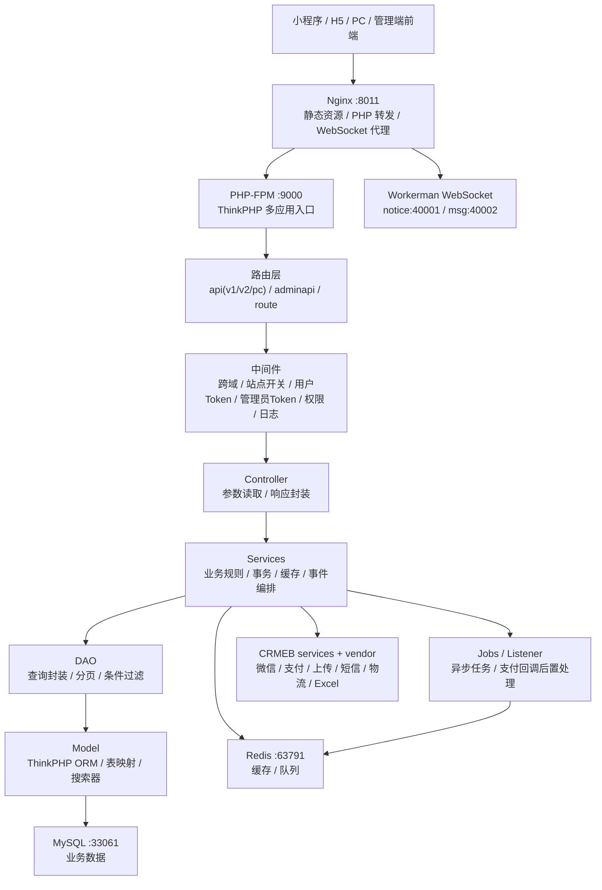

# 后端 Docker 运行与架构审查报告（2026-06-26）

## 1. 结论

- 本地 Docker 已启动并运行 CRMEB 后端服务，访问地址为 `http://localhost:8011/`，管理端地址为 `http://localhost:8011/admin/`。
- 后端主体位于 `src/CRMEB/CRMEB-master/crmeb`，是基于 ThinkPHP 多应用模式的 CRMEB 后端。
- Docker 编排位于 `src/CRMEB/CRMEB-master/help/docker/docker-compose.yml`，包含 Nginx、PHP-FPM、MySQL、Redis 四个服务。
- 本次使用现有 `crmeb_fast_code` Docker 卷承载后端代码，并已将当前仓库代码同步到该卷。
- 数据库已完成初始化，共 157 张表；安装过程中 `eb_agent_level` 因 SQL 文件开头字符导致首次建表失败，已从安装 SQL 中补建并导入 5 条默认等级数据。

## 2. 本地运行清单

| 项目 | 状态 | 说明 |
| --- | --- | --- |
| Docker CLI | 正常 | Docker `29.5.3`，Compose `v5.1.4` |
| Docker Engine | 正常 | 已启动 Docker Desktop Linux 引擎 |
| 代码卷 | 正常 | `crmeb_fast_code`，挂载到 PHP 容器 `/var/www` |
| Nginx | 正常 | `crmeb_nginx`，宿主机端口 `8011 -> 80` |
| PHP-FPM | 正常 | `crmeb_php`，宿主机端口 `9000 -> 9000` |
| MySQL | 正常 | `crmeb_mysql`，宿主机端口 `33061 -> 3306` |
| Redis | 正常 | `crmeb_redis`，宿主机端口 `63791 -> 6379` |
| Workerman 通知 | 端口可连 | `40001` |
| Workerman 消息 | 端口可连 | `40002` |
| 首页 | 正常 | `GET /` 返回 `200` |
| 管理端页面 | 正常 | `GET /admin/` 返回 `200` |
| 公开版本接口 | 正常 | `GET /api/version` 返回 `CRMEB-KY v6.0.0` |
| 公开配置接口 | 正常 | `GET /api/basic_config` 返回 `200` |
| 管理端登录接口 | 正常 | `POST /adminapi/login` 返回 token、用户信息和菜单 |

本地管理账号：

| 账号 | 密码 | 用途 |
| --- | --- | --- |
| `admin` | `crmeb123456` | 本地 Docker 初始化管理员 |

> 该密码仅用于本地开发环境。若后续暴露到局域网或公网，应立即修改。

## 3. 后端架构图



## 4. 后端模块清单

| 模块 | 路径 | 职责 |
| --- | --- | --- |
| 全局入口 | `public/index.php`、`route/route.php` | 安装检测、HTTP 入口、前端页面兜底路由 |
| C 端 API | `app/api` | 小程序、H5、PC 公开接口 |
| 管理端 API | `app/adminapi` | 后台登录、菜单、商品、订单、用户、系统等管理接口 |
| 服务层 | `app/services` | 核心业务编排、事务、事件、缓存、支付和订单流程 |
| DAO 层 | `app/dao` | 查询封装、分页、条件过滤 |
| 模型层 | `app/model` | ThinkPHP ORM 表映射、搜索器、访问器 |
| 异步任务 | `app/jobs` | 库存、订单后置处理、退款、自动取消、通知等队列任务 |
| 事件监听 | `app/listener` | 支付、订单、用户、通知等事件响应 |
| 通用基础服务 | `crmeb/services` | 微信、支付、上传、短信、物流、打印、Workerman 等封装 |
| 配置 | `config` | 数据库、缓存、队列、上传、支付、Workerman、退役功能配置 |
| 依赖 | `vendor` | Composer 第三方依赖 |

代码规模快照：

| 区域 | PHP 文件数 |
| --- | ---: |
| `app/api` | 52 |
| `app/adminapi` | 120 |
| `app/services` | 231 |
| `app/dao` | 169 |
| `app/model` | 152 |
| `app/jobs` | 29 |
| `app/listener` | 20 |

## 5. 路由与接口面

C 端路由：

- `app/api/route/v1.php`：登录、公众号/小程序服务、支付回调、商品、购物车、订单、用户、地址、积分、分销、教育测评等。
- `app/api/route/v2.php`：部分 v2 商品、购物车、用户搜索、微信授权等接口。
- `app/api/route/pc.php`：PC 首页、商品、扫码登录、购物车、订单、用户记录等接口。

管理端路由：

- `product.php`：商品、分类、规格、标签、参数、保障、评论。
- `order.php`：订单、发货、售后、退款、物流。
- `user.php`：用户、等级、分组、标签、会员卡。
- `system.php`：系统日志、升级、定时任务、事件、路由权限、CRUD。
- `setting.php`：系统配置、协议、菜单、角色、管理员、存储。
- `statistic.php`：用户、商品、订单、交易、余额、流水统计。
- `finance.php`、`file.php`、`notify.php`、`education.php` 等提供财务、文件、通知、教育模块能力。

## 6. 数据与基础设施

数据库：

- 默认库名：`crmeb`
- 表前缀：`eb_`
- 当前表数：157
- 管理员表：`eb_system_admin`，当前 1 条管理员记录
- 商品表：`eb_store_product`，当前 4 条示例商品记录

缓存与队列：

- `.env` 中 `CACHE.DRIVER = redis`
- Redis 主机：`crmeb_redis`
- 队列驱动：Redis
- 队列名后缀来自 `.env` 的 `QUEUE_NAME`

实时服务：

- Nginx `/notice` 代理到 PHP 容器 `40001`
- Nginx `/msg` 代理到 PHP 容器 `40002`
- 端口 `40001` 和 `40002` 均已验证可连

## 7. 运行过程中的发现

- `docker-compose.yml` 使用外部卷 `crmeb_fast_code`，不会直接挂载仓库目录；如果修改后端代码，需要再次同步到该卷，或改用开发挂载方式。
- Compose 启动时提示存在孤立容器 `crmeb_db_init`，当前不影响四个主服务运行；如果确认不再使用，可后续清理。
- 项目 Docker 文档存在编码乱码，但 compose 文件结构可用。
- 源码目录没有 `.env`，`.env` 存在于 Docker 代码卷中；本次安装写入的是卷内 `.env`。
- 安装 SQL 第一条表语句受文件开头字符影响失败，已手动补建 `eb_agent_level`。建议后续清理 `public/install/crmeb.sql` 文件开头 BOM/注释边界，避免新环境复现。
- 管理菜单仍包含部分历史营销能力菜单和权限项，虽然已有退役过滤配置，后续如果要继续瘦身，应继续审查数据库种子、路由、服务引用和前端入口的一致性。

## 8. 常用本地命令

```powershell
# 启动
docker compose -f src\CRMEB\CRMEB-master\help\docker\docker-compose.yml up -d

# 查看状态
docker compose -f src\CRMEB\CRMEB-master\help\docker\docker-compose.yml ps

# 查看日志
docker logs --tail 100 crmeb_nginx
docker logs --tail 100 crmeb_php
docker logs --tail 100 crmeb_mysql
docker logs --tail 100 crmeb_redis

# 停止
docker compose -f src\CRMEB\CRMEB-master\help\docker\docker-compose.yml down
```

## 9. 建议后续动作

- 增加一个开发用 compose override，把仓库后端目录直接挂载到 `/var/www`，减少每次改代码后同步 Docker 卷的成本。
- 修复安装 SQL 首条语句的 BOM/注释问题，并用空库重新验证安装流程。
- 清理或确认 `crmeb_db_init` 孤立容器来源。
- 将 Docker 启动与健康检查写成 `docs` 中的短操作手册，覆盖首次安装、已有数据库启动、重装三种路径。
- 对管理端菜单退役过滤做一次登录后接口合同测试，防止历史功能入口回流。
